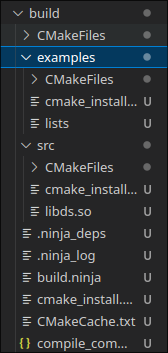

# 配置环境

## 软件安装

......


## 基本文件夹

```Bash
mkdir -p src include examples
```

`src` 用于存放源文件

`include` 用于存放头文件

`examples` 用于存放示例文件

## CMake 配置

首先是顶层的 `CMakeLists.txt`

`./CMakeLists.txt`

```CMake
cmake_minimum_required(VERSION 3.5)

# 项目名称
project(DSAAC)

# 导入src子目录， 类似 include
add_subdirectory(src)

# 导入 examples
add_subdirectory(examples)
```

这里新建 `include/list.h` `src/list.c` `src/CMakeLists.txt`

`src/CMakeLists.txt`
```CMake
# 添加库 取名为 ds 且共享库
add_library(ds SHARED 
  list.c)

# 头文件目录 DSAAC 我们项目的主名称 DSAAC, 这里表示项目源文件路径
target_include_directories(ds PUBLIC ${DSAAC_SOURCE_DIR}/include)

```
`examples/CMakeLists.txt`
```CMake
link_libraries(ds)

# 头文件目录设定
include_directories(${DSAAC_SOURCE_DIR}/include)

# 添加执行文件 这是链表的测试
add_executable(lists lists.c)
```

设置链表头文件的声明

`include/list.h`
```C
#include <init.h>
#include <stdlib.h>
#ifndef _LINKED_LIST_H
struct Node;
typedef struct Node *PtrToNode;
typedef PtrToNode List;
typedef PtrToNode Position;

List MakeEmpty(List L);
int IsEmpty(List L);
int IsLast(Position P, List L);
Position find(ElementType X, List L);
void Delete(ElementType X, List L);
Position FindPrevious(ElementType X, List L);
void Insert(ElementType X, List L);
void DeleteList(List L);
Position Header(List L);
Position First(List L);
Position Advance(Position P);
ElementType Retrieve(Position P);

#endif
```

简单实例化 list

`src/list.c`
```C
#include "init.h"
#include <list.h>

// 实例化
struct Node {
  ElementType Element;
  Position Next;
};
```

新建一个 `examples/lists.c` 文件， 接下来测试是否编译成功

`examples/lists.c`
```C
#include <stdio.h>
#include <list.h>
int main() {
    return 0;
}
```
如果你是VSCode用户， 或者支持CMake的IDE, 可以跳过 `Makefile` 配置

新建一个 `Makefile`, 方便一键编译, 这里还是调用 `cmake`，构建模式为 `Debug`, 使用 `clang` 编译c语言，`clang++` 编译cpp， 指定源文件, 指定构建目录, 指定编译工具为 `Ninja`, 你也可以选择 `Make` 作为编译工具, 首先会init初始化，最后链接生成文件

这里命令抄录 `VSCode`

`Makefile`
```Makefile
build: init
	@cmake --build /home/dingduck/Project/cl/dsaac/build --config Debug --target all --


init:
	@cmake --no-warn-unused-cli \
				-DCMAKE_BUILD_TYPE:STRING=Debug \
				-DCMAKE_EXPORT_COMPILE_COMMANDS:BOOL=TRUE \
				-DCMAKE_C_COMPILER:FILEPATH=/usr/bin/clang \
				-DCMAKE_CXX_COMPILER:FILEPATH=/usr/bin/clang++ \
				-S/home/dingduck/Project/cl/dsaac \
				-B/home/dingduck/Project/cl/dsaac/build \
				-G Ninja

clean:
	@rm -rf build && echo cleanup all build files

使用 `make` 目录即可编译， `make clean` 用于清理编译
```

接下来使用 `make` 构建我们的项目, `make clean` 用于清除构建

`VSCode` CMake 菜单默认在左下角, 可以直接点击生成来构建

在 `build` 下会生成很多文件
 

`examples` 下 lists 就是源文件 lists.c 的可执行文件

`src` 下 `libds.so` 就是动态库, 但是目前 `ldd` 命令却发现 `lists` 没有链接至 `libds.so`

到目前为止， 项目已经配置完了
